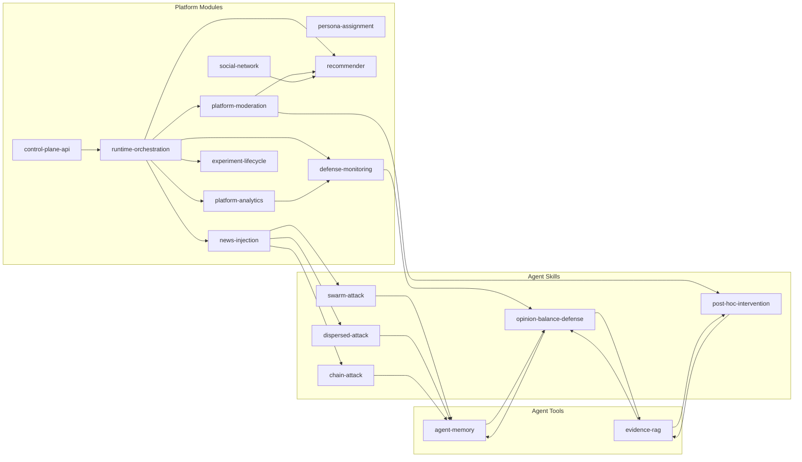

# EvoSim 面向 Agent 的 Skill 架构重分类

## 1. 重分类前提

本文采用当前 Agent 领域更贴近主流的定义：

- `Agent Skill`：面向 LLM/agent 暴露的专门能力包，核心价值是指导 agent 在特定情境下如何思考、决策、协作与调用工具。
- `Agent Tool / Capability Service`：供 agent 调用的能力底座，本身不是技能说明，而是被技能依赖的系统能力。
- `Platform Module / Infrastructure`：平台业务模块、运行时编排、数据库写入、控制接口与实验基础设施。

因此，是否属于 `skill`，判断关键不是“它是否重要”，而是：

1. 是否主要服务于 LLM/agent 的行为决策。
2. 是否适合作为 agent 按需加载/调用的能力边界。
3. 是否比函数更高阶、但又不是整个平台基础设施。

---

## 2. 最终重分类（17 个候选项）

### 2.1 Agent Skills（5）

1. `swarm-attack`：恶意 agent 的集中协同攻击技能
2. `dispersed-attack`：恶意 agent 的分散渗透攻击技能
3. `chain-attack`：恶意 agent 的链式接力传播技能
4. `opinion-balance-defense`：防御 agent 的协同防御技能
5. `post-hoc-intervention`：事实核查/纠偏 agent 的事后干预技能

### 2.2 Agent Tools / Capability Services（2）

6. `agent-memory`：agent 记忆写入、反思缓存、经验读取能力
7. `evidence-rag`：证据/策略检索能力

### 2.3 Platform Modules / Infrastructure（10）

8. `persona-assignment`：角色与 persona 分配模块
9. `news-injection`：新闻与真假叙事注入模块
10. `recommender`：候选召回、排序与曝光模块
11. `social-network`：关注关系与社交图维护模块
12. `platform-moderation`：内容审核与治理模块
13. `platform-analytics`：社区、茧房、传播结构分析模块
14. `runtime-orchestration`：仿真主循环与调度基础设施
15. `control-plane-api`：运行时开关与控制接口
16. `experiment-lifecycle`：快照、恢复、导出与复现模块
17. `defense-monitoring`：防御态势监测与看板模块

---

## 3. 重分类表（按 17 项逐项判断）

| 候选项 | 新分类 | 保留/降级原因 | 说明 |
| --- | --- | --- | --- |
| `persona-assignment` | Platform Module | 主要是初始化与分配逻辑 | 更像 bootstrap service，不是 agent 技能 |
| `news-injection` | Platform Module | 主要负责场景驱动与发帖注入 | 是平台内容生成机制，不是技能包 |
| `recommender` | Platform Module | 是平台分发流水线 | 可被 agent 影响，但本体不是 agent skill |
| `agent-memory` | Agent Tool | 是记忆能力底座 | agent 可调用，但它本体不是技能说明 |
| `social-network` | Platform Module | 关系图读写与初始化 | 更像 graph/repository service |
| `platform-moderation` | Platform Module | 审核、裁决、治理执行 | 是平台治理能力，不是 agent 技能 |
| `platform-analytics` | Platform Module | 结构分析与诊断输出 | 更像分析模块/报表模块 |
| `runtime-orchestration` | Infrastructure | 是运行时引擎本身 | 不应被当作 skill |
| `control-plane-api` | Infrastructure | 是控制接口适配层 | 不应和技能概念混用 |
| `experiment-lifecycle` | Platform Module | 快照与实验管理能力 | 更像实验基础设施 |
| `swarm-attack` | Agent Skill | 描述恶意 agent 的攻击策略 | 可以作为 LLM/bot 的行为技能 |
| `dispersed-attack` | Agent Skill | 描述恶意 agent 的分散渗透策略 | 同上 |
| `chain-attack` | Agent Skill | 描述恶意 agent 的链式扩散策略 | 同上 |
| `opinion-balance-defense` | Agent Skill | 描述防御 agent 如何分析、分工、干预 | 典型 agent 协作技能 |
| `defense-monitoring` | Platform Module | 当前更像指标汇总与 dashboard | 可为 skill 提供信号，但本体不算 skill |
| `post-hoc-intervention` | Agent Skill | 描述纠偏 agent 如何事后干预 | 符合行动型技能定义 |
| `evidence-rag` | Agent Tool | 是检索增强能力底座 | skill 会依赖它，但它本身更像 tool |

---

## 4. 重新定义后的三层边界

### 4.1 Agent Skill 的边界

只有当一个候选项同时满足下面条件时，才应该叫 `skill`：

- 它面向 agent 暴露，而不是面向平台内部模块暴露。
- 它描述的是“在什么情境下做什么决策与行动”。
- 它可以被 prompt、角色设定、工作流约束、工具调用共同实现。
- 它的价值主要来自行为策略，而不只是数据库读写或算法执行。

因此，攻击与防御、纠偏这类“行动策略包”更适合作为 skill。

### 4.2 Agent Tool 的边界

下列能力不应直接称作 skill，而应称作 tool 或 capability：

- 记忆存取
- 证据检索
- 历史经验查询
- 结构化观察数据读取

它们更像 agent 的“手”和“眼”，而不是 agent 的“策略脑”。

### 4.3 Platform Module 的边界

下列职责应从 skill 语义中剥离：

- 平台主循环
- 分发与排序
- 社交图维护
- 内容审核执行
- 快照与实验管理
- 控制接口与 flags

这些职责主要是平台运行机制，不是 agent 技能。

---

## 5. 新结构图

### 5.1 三层树

```text
EvoSim Agent-Oriented Architecture
├─ Agent Skills (5)
│  ├─ swarm-attack
│  ├─ dispersed-attack
│  ├─ chain-attack
│  ├─ opinion-balance-defense
│  └─ post-hoc-intervention
├─ Agent Tools / Capability Services (2)
│  ├─ agent-memory
│  └─ evidence-rag
└─ Platform Modules / Infrastructure (10)
   ├─ persona-assignment
   ├─ news-injection
   ├─ recommender
   ├─ social-network
   ├─ platform-moderation
   ├─ platform-analytics
   ├─ runtime-orchestration
   ├─ control-plane-api
   ├─ experiment-lifecycle
   └─ defense-monitoring
```

### 5.2 行为关系图



---

## 6. 对现有代码锚点的重新解释

### 6.1 真正可能升成 Agent Skill 的代码锚点

| Agent Skill | 当前主要锚点 | 重解释 |
| --- | --- | --- |
| `swarm-attack` | `src/malicious_bots/attack_orchestrator.py` | 不是一个平台模块名，而是恶意 agent 的群体攻击策略 |
| `dispersed-attack` | `src/malicious_bots/attack_orchestrator.py` | 是同一攻击域里的另一种技能策略 |
| `chain-attack` | `src/malicious_bots/attack_orchestrator.py` | 是同一攻击域里的链式传播技能 |
| `opinion-balance-defense` | `src/opinion_balance_manager.py`, `src/agents/simple_coordination_system.py` | 应被定义为防御 agent 的协作技能包 |
| `post-hoc-intervention` | `src/fact_checker.py`, `src/simulation.py` | 应被定义为纠偏与澄清行动技能 |

### 6.2 应降级为 Agent Tool 的代码锚点

| Agent Tool | 当前主要锚点 | 重解释 |
| --- | --- | --- |
| `agent-memory` | `src/agent_memory.py`, `src/action_logs_store.py` | 提供记忆与反思能力，不直接代表技能 |
| `evidence-rag` | `src/advanced_rag_system.py`, `evidence_database/*` | 提供检索增强能力，不直接代表行为技能 |

### 6.3 应明确为平台模块的代码锚点

| Platform Module | 当前主要锚点 | 重解释 |
| --- | --- | --- |
| `recommender` | `src/recommender/feed_pipeline.py` | 平台分发引擎 |
| `platform-moderation` | `src/moderation/service.py` | 平台治理服务 |
| `runtime-orchestration` | `src/simulation.py` | 主循环与调度基础设施 |
| `experiment-lifecycle` | `src/snapshot_manager.py`, `src/snapshot_session.py` | 实验与快照管理 |
| `defense-monitoring` | `src/agents/defense_monitoring_center.py` | 防御观测模块，而非 skill |

---

## 7. 建议的命名修正

如果要让命名和 Agent 领域保持一致，建议不要继续把全部 17 项统称为 `skills`，而改为：

- `Agent Skills`
- `Agent Tools`
- `Platform Modules`

更具体一点：

- `attack skills`
- `defense skill`
- `intervention skill`
- `memory tool`
- `rag tool`
- `platform modules`

这样在文档、代码目录、运行时注册表里都不容易混淆。

---

## 8. 对后续 runtime 设计的影响

### 8.1 Registry 不应只注册 `skills`

如果继续推进统一注册表，建议注册表改成能容纳三类对象：

```python
{
  "name": "opinion-balance-defense",
  "kind": "agent-skill",   # agent-skill | agent-tool | platform-module
  "phase": "defense",
  "depends_on": ["defense-monitoring", "evidence-rag"],
}
```

这样 runtime 不会再把平台模块误建模成 skill。

### 8.2 Agent 调用链应显式分层

推荐调用链：

1. `runtime-orchestration` 调度平台 phase
2. 平台模块准备上下文、帖子、信号、控制 flags
3. 满足条件时触发某个 `agent skill`
4. `agent skill` 再调用 `agent-memory` / `evidence-rag`
5. 结果回写平台模块与数据库

### 8.3 事件语义应避免误导

建议事件也分层命名：

- 平台事件：`feed_exposed`, `moderation_applied`, `snapshot_saved`
- 技能事件：`attack_plan_created`, `defense_response_generated`, `intervention_decided`
- 工具事件：`memory_retrieved`, `rag_result_ready`

---

## 9. 最终建议

如果你的目标是“做成可拔插的高级解耦架构”，那最稳的做法不是把 17 个都强行叫 `skill`，而是：

- 只把真正面向 agent 的行为策略保留为 `Agent Skills`
- 把能力底座定义为 `Agent Tools`
- 把平台运行机制归入 `Platform Modules / Infrastructure`

这会比“17 skill 全部平铺”更符合 Agent 领域语义，也更利于后续演进：

- 语义更准
- 编排边界更清楚
- LLM 与非 LLM 部分更容易拆开
- 未来替换 agent 策略时，不必改平台主链路

---

## 10. 推荐的最小落地版本

第一阶段建议只显式保留 5 个 `Agent Skill`：

1. `swarm-attack`
2. `dispersed-attack`
3. `chain-attack`
4. `opinion-balance-defense`
5. `post-hoc-intervention`

再保留 2 个 `Agent Tool`：

6. `agent-memory`
7. `evidence-rag`

其余全部按平台模块对待。

这样你的架构语言会立即变干净，不会再出现“一个 SQLite 快照管理器为什么也叫 skill”这种概念冲突。
