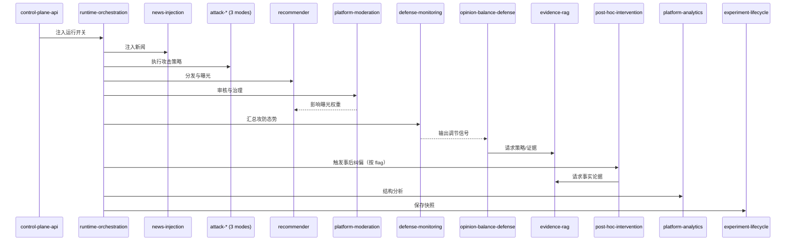

# EvoSim Skill 架构

## 1. 最终分层（17 个 Skill）

### 1.1 平台基础层（10）

1. `persona-assignment`：角色抽取与人设分配
2. `news-injection`：新闻注入与真假叙事投放
3. `recommender`：候选召回、排序与曝光分发
4. `agent-memory`：记忆存取与反思缓存
5. `social-network`：关注关系与社交图维护
6. `platform-moderation`：内容审核与治理动作执行
7. `platform-analytics`：社区、茧房与传播结构分析
8. `runtime-orchestration`：仿真主循环与任务调度
9. `control-plane-api`：运行时开关控制接口
10. `experiment-lifecycle`：快照恢复、导出与复现

### 1.2 攻击层（3）

11. `swarm-attack`：集中协同攻击
12. `dispersed-attack`：分散渗透攻击
13. `chain-attack`：链式接力传播攻击

### 1.3 防御层（2）

14. `opinion-balance-defense`：多角色主动防御
15. `defense-monitoring`：防御效果实时监测

### 1.4 干预层（1）

16. `post-hoc-intervention`：事后纠偏干预

### 1.5 知识层（1）

17. `evidence-rag`：证据/策略双通道检索

---

## 2. Skill 边界定义（按层压缩版）

### 2.1 平台基础层（10）

| Skill                     | 核心职责                      | 关键输入                     | 关键输出                 | 代码锚点                                                                                          |
| ------------------------- | ----------------------------- | ---------------------------- | ------------------------ | ------------------------------------------------------------------------------------------------- |
| `persona-assignment`    | 为用户/agent/bot 分配 persona | persona 配置、用户类型       | 角色标签、行为倾向       | `src/persona_manager.py`, `src/user_manager.py`                                               |
| `news-injection`        | 注入新闻与真假映射            | 新闻源、注入策略             | 新闻帖子、真假映射       | `src/news_manager.py`                                                                           |
| `recommender`           | feed 召回排序与曝光           | 用户上下文、候选池、审核状态 | 用户 feed、曝光日志      | `src/recommender/feed_pipeline.py`                                                              |
| `agent-memory`          | 记忆写入与检索桥接            | 交互事件、反思文本           | memory 记录、action logs | `src/agent_memory.py`, `src/action_logs_store.py`                                             |
| `social-network`        | 维护关注图关系                | follow/unfollow 事件         | `follows` 图结构       | `src/database_manager.py`, `src/agent_user.py`                                                |
| `platform-moderation`   | 审核与治理动作执行            | 内容、规则、审核开关         | 审核裁决、治理日志       | `src/moderation/service.py`                                                                     |
| `platform-analytics`    | 社区/茧房/传播结构分析        | 关系图、曝光/互动日志        | 结构指标、诊断快照       | `src/community_detector.py`, `src/filter_bubble_analyzer.py`, `src/news_spread_analyzer.py` |
| `runtime-orchestration` | tick 与 phase 调度            | tick、配置、控制开关         | phase 执行结果           | `src/simulation.py`                                                                             |
| `control-plane-api`     | `/control/*` 运行时控制     | API 请求                     | flags 状态变更           | `src/main.py`, `src/run_control_server.py`                                                    |
| `experiment-lifecycle`  | 快照/恢复/导出                | session/tick 元数据          | 快照、恢复点、导出包     | `src/snapshot_manager.py`, `src/snapshot_session.py`                                          |

### 2.2 攻击、防御、干预、知识层（7）

| Skill                       | 核心职责            | 关键输入                 | 关键输出                  | 代码锚点                                                                         |
| --------------------------- | ------------------- | ------------------------ | ------------------------- | -------------------------------------------------------------------------------- |
| `swarm-attack`            | 集中攻击同一目标    | 目标帖子、bot 集群       | 攻击评论/互动             | `src/malicious_bots/attack_orchestrator.py`                                    |
| `dispersed-attack`        | 分散渗透多主题      | 帖子池、预算             | 分散攻击轨迹              | `src/malicious_bots/attack_orchestrator.py`                                    |
| `chain-attack`            | 链式接力扩散叙事    | 源头内容、链路参数       | 链式传播轨迹              | `src/malicious_bots/attack_orchestrator.py`                                    |
| `opinion-balance-defense` | 多角色协同防御      | 极化风险、舆情上下文     | 防御动作、干预记录        | `src/opinion_balance_manager.py`, `src/agents/simple_coordination_system.py` |
| `defense-monitoring`      | 防御效果与态势监测  | 攻防事件、互动指标       | 预警信号、评估结果        | `src/agents/defense_monitoring_center.py`                                      |
| `post-hoc-intervention`   | 事后事实纠偏        | 已扩散内容、审核记录     | 纠偏动作、fact-check 记录 | `src/fact_checker.py`, `src/simulation.py`                                   |
| `evidence-rag`            | 证据/策略双通道检索 | query、context、`type` | 证据包或策略包            | `src/advanced_rag_system.py`, `evidence_database/*`                          |

---

## 3. 单一实施计划（Phase 0~5）

### 3.1 Phase 0：Runtime 骨架

- 目标：先建立 skill runtime，不改业务逻辑。
- 交付：`contracts.py`, `registry.py`, `orchestrator.py`, `context_builder.py`, `policies.py`。
- 验收：
  - 可注册 dummy skill。
  - 可按 phase 顺序调度。
  - `SkillRequest/SkillResult` 可序列化。

### 3.2 Phase 1：主链路 MVP（4 skill）

- 范围：`runtime-orchestration`, `recommender`, `platform-moderation`, `experiment-lifecycle`。
- 关键改造：
  - 在 `Simulation.run(...)` 接入 orchestrator。
  - `platform-moderation` 使用 `check_posts()`/`check_post()` 包装。
- 验收：
  - 单 tick 主流程跑通。
  - 调度日志可见每个 phase。
  - 性能增量 <5%。

### 3.3 Phase 2：攻防与知识闭环

- 范围：`swarm/dispersed/chain-attack`, `opinion-balance-defense`, `evidence-rag`。
- 关键改造：
  - 外部保持 3 个攻击 skill，内部复用一个 attack orchestrator。
  - `evidence-rag` 强制 `type in {evidence, strategy}`。
- 验收：
  - 攻击模式可切换。
  - 防御协同生效。
  - RAG 双路径严格分离。

### 3.4 Phase 3：观测与反馈层

- 范围：`platform-analytics`, `defense-monitoring`, `agent-memory`。
- 关键改造：
  - `platform-analytics` 负责结构诊断。
  - `defense-monitoring` 负责实时防御反馈。
  - `agent-memory` 回写行动日志并供 `evidence-rag(type=strategy)` 调用。
- 验收：
  - 分析指标可导出。
  - 监测信号可驱动防御调节。
  - 历史防御行为可检索复用。

### 3.5 Phase 4：基础能力补齐

- 范围：`persona-assignment`, `social-network`, `news-injection`, `control-plane-api`。
- 关键改造：
  - fresh run 执行 persona/关系初始化，snapshot restore 跳过重复初始化。
  - control flags 统一作为单一真值。
- 验收：
  - 初始化逻辑正确且不重复。
  - 开关可实时影响运行链路。

### 3.6 Phase 5：干预层收口与全链路压测

- 范围：`post-hoc-intervention` + 全链路集成。
- 关键改造：
  - `post-hoc-intervention` 依赖 `evidence-rag(type=evidence)`。
  - 与审核、防御、快照流程对齐。
- 验收：
  - 17 skill 全接入。
  - 无 silent fallback。
  - 快照任意 tick 恢复可继续运行。

---

## 4. 运行时契约与编排硬约束

### 4.1 统一契约（必须）

```python
@dataclass
class SkillRequest:
    contract_version: str
    run_id: str
    tick: int
    phase: str
    skill: str
    payload: dict
    flags: dict

@dataclass
class SkillResult:
    contract_version: str
    status: str          # ok | skip | error
    events: list[dict]
    writes: dict
    metrics: dict
    errors: list[str]
```

### 4.2 Registry 元数据（必须）

```python
{
  "name": "platform-moderation",
  "phase": "governance",
  "depends_on": ["recommender"],
  "criticality": "critical",       # critical | standard | optional
  "timeout_ms": 8000,
  "max_retries": 1,
  "on_failure": "abort_tick",      # abort_tick | skip_downstream | degrade_mode
}
```

### 4.3 失败传播策略（必须）

| criticality  | 默认 on_failure     | 行为                         |
| ------------ | ------------------- | ---------------------------- |
| `critical` | `abort_tick`      | 终止当前 tick，避免污染状态  |
| `standard` | `skip_downstream` | 跳过依赖分支，继续无依赖分支 |
| `optional` | `degrade_mode`    | 降级执行并记录告警           |

推荐归类：

- `critical`：`runtime-orchestration`, `recommender`, `platform-moderation`, `experiment-lifecycle`
- `standard`：`opinion-balance-defense`, `defense-monitoring`, `post-hoc-intervention`, `evidence-rag`
- `optional`：`platform-analytics`

### 4.4 并行规则（建议）

- phase 内并行前提：
  - 无 `depends_on` 关系。
  - 无共享写冲突。
  - `events` 合并顺序稳定。
- 初始白名单：`platform-analytics` 与 `defense-monitoring` 读路径并行，其余默认串行。

### 4.5 强约束（必须）

- `evidence-rag`：
  - 仅允许 `type=evidence | strategy`。
  - 非法或缺失 `type` 直接 `error`，禁止 fallback。
- 攻击层：
  - 对外 3 skill（便于观测）。
  - 对内 1 份实现（按 mode 路由）。
- 快照恢复：
  - 必须记录 `contract_version`、`registry_hash`、`enabled_skills`。
  - 主版本不兼容时拒绝恢复。

---

## 5. 交互关系图与风险矩阵

### 5.1 Tick 级交互图



### 5.2 最小风险矩阵

| 风险                       | 影响 | 缓解                                   |
| -------------------------- | ---- | -------------------------------------- |
| phase 顺序错误导致数据竞争 | 高   | `depends_on` 静态校验 + 默认串行     |
| skill 契约升级破坏快照恢复 | 高   | 版本字段 + 恢复迁移器 + 不兼容拒绝恢复 |
| RAG 双路径混用             | 中   | `type` 强校验 + 检索审计日志         |
| orchestration 额外开销过大 | 中   | 先保证正确性，再逐步启用并行白名单     |
