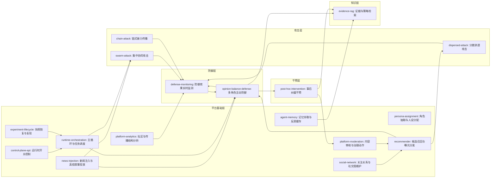
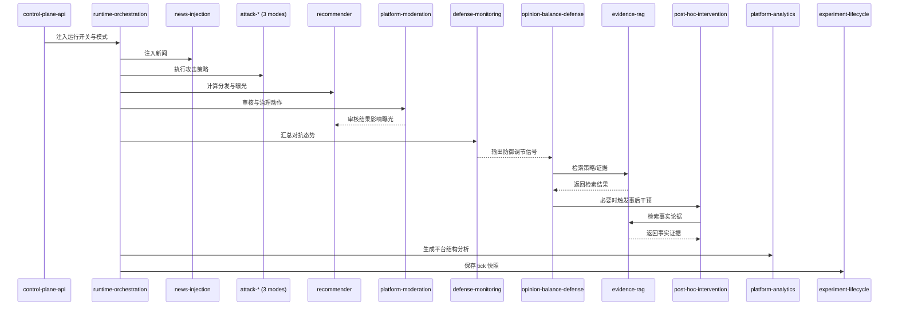

# EvoSim 17 Skill 最终拆解与结构图

## 1. 最终分层（17 个）

### 平台基础层（10）

1. `persona-assignment`：角色抽取与人设分配
2. `news-injection`：新闻注入与真假叙事投放
3. `recommender`：候选召回、排序与曝光分发
4. `agent-memory`：记忆存取与反思缓存
5. `social-network`：关注关系与社交图维护
6. `platform-moderation`：内容审核与治理动作执行
7. `platform-analytics`：社区、茧房与传播结构分析
8. `runtime-orchestration`：仿真主循环与任务调度
9. `control-plane-api`：运行时开关控制接口
10. `experiment-lifecycle`：快照恢复、导出与复现

### 攻击层（3）

11. `swarm-attack`：集中协同攻击
12. `dispersed-attack`：分散渗透攻击
13. `chain-attack`：链式接力传播攻击

### 防御层（2）

14. `opinion-balance-defense`：多角色主动防御
15. `defense-monitoring`：防御效果实时监测

### 干预层（1）

16. `post-hoc-intervention`：事后纠偏干预

### 知识层（1）

17. `evidence-rag`：证据/策略双通道检索

---

## 2. Skill 详细定义（职责/输入/输出/锚点）

| Skill                       | 层级 | 主要职责                                                       | 关键输入                                 | 关键输出                               | 代码锚点                                                                                                                         |
| --------------------------- | ---- | -------------------------------------------------------------- | ---------------------------------------- | -------------------------------------- | -------------------------------------------------------------------------------------------------------------------------------- |
| `persona-assignment`      | 平台 | 从 persona 库中为普通用户、防御 agent、攻击 bot 分配画像与标签 | persona 数据库、用户类型、实验配置       | 用户画像、角色标签、初始行为倾向       | `src/persona_manager.py`, `src/utils_package/persona_loader.py`, `src/user_manager.py`                                     |
| `news-injection`          | 平台 | 注入中性/争议/虚假新闻，驱动舆情演化场景                       | 新闻数据集、时间步配置、注入比例         | 发布后的新闻帖子、真假映射关系         | `src/news_manager.py`                                                                                                          |
| `recommender`             | 平台 | 执行候选召回、打分、过滤、选择与曝光                           | 用户上下文、关注关系、帖子候选、审核状态 | 用户 feed、曝光记录                    | `src/recommender/feed_pipeline.py`, `src/recommender/*`                                                                      |
| `agent-memory`            | 平台 | 管理交互记忆、反思记忆与可检索经验                             | 交互事件、反思文本、重要度评分           | 记忆记录、反思缓存、可检索条目         | `src/agent_memory.py`, `src/action_logs_store.py`                                                                            |
| `social-network`          | 平台 | 管理关注关系、网络连接与社交图读写                             | follow/unfollow 行为、用户关系事件       | `follows` 图结构、关系查询结果       | `src/database_manager.py`, `src/agent_user.py`, `src/user_manager.py`                                                      |
| `platform-moderation`     | 平台 | 审核帖子/评论并执行降权、标记、下架、封禁动作                  | 内容文本、审核配置、违规规则             | 审核裁决、治理动作落库结果             | `src/moderation/service.py`, `src/moderation/actions/*`                                                                      |
| `platform-analytics`      | 平台 | 做社区、茧房、传播、同质性等平台结构分析                       | 关系图、帖子评论、曝光日志               | 结构分析指标、诊断数据                 | `src/community_detector.py`, `src/filter_bubble_analyzer.py`, `src/news_spread_analyzer.py`, `src/homophily_analysis.py` |
| `runtime-orchestration`   | 平台 | 编排系统主循环、异步任务与时步推进                             | 全局配置、时间步、任务状态               | 调度结果、任务状态、流程生命周期       | `src/simulation.py`, `src/main.py`                                                                                           |
| `control-plane-api`       | 平台 | 提供运行时控制开关与状态接口                                   | 前端控制请求、运行标志位                 | attack/moderation/aftercare 等开关状态 | `src/main.py`, `src/run_control_server.py`, `frontend_api.py`                                                              |
| `experiment-lifecycle`    | 平台 | 管理快照、恢复、导出与复现实验                                 | 当前数据库状态、会话元数据、导出参数     | 快照、恢复点、实验归档文件             | `src/snapshot_manager.py`, `src/snapshot_session.py`, `src/scenario_export_manager.py`                                     |
| `swarm-attack`            | 攻击 | 多 bot 对同一目标集中攻击，短时抬升情绪强度                    | 目标帖子、参与 bot、角色分布             | 集中式攻击评论与互动                   | `src/malicious_bots/attack_orchestrator.py`, `src/malicious_bots/coordination_strategies.py`                                 |
| `dispersed-attack`        | 攻击 | 多 bot 分散到不同帖子/话题渗透传播                             | 帖子池、攻击预算、bot 集群               | 分散式攻击痕迹与互动                   | `src/malicious_bots/attack_orchestrator.py`, `src/malicious_bots/coordination_strategies.py`                                 |
| `chain-attack`            | 攻击 | 通过链路接力推动叙事扩散                                       | 源头内容、链式参数、时步信息             | 链式传播轨迹与接力内容                 | `src/malicious_bots/attack_orchestrator.py`, `src/malicious_bots/coordination_strategies.py`                                 |
| `opinion-balance-defense` | 防御 | 组织 empath/fact-checker/amplifier/niche-filler 进行主动防御   | 极化风险、舆情上下文、干预阈值           | 协同防御响应、干预记录                 | `src/opinion_balance_manager.py`, `src/agents/simple_coordination_system.py`, `src/agents/defense_agent_types.py`          |
| `defense-monitoring`      | 防御 | 监控防御效果与对抗态势（生态位、话语权、集中度）               | 防御动作结果、互动指标、对抗状态         | 防御看板、预警信号、评估结果           | `src/agents/defense_monitoring_center.py`                                                                                      |
| `post-hoc-intervention`   | 干预 | 对已传播内容做事后纠偏与修复干预                               | 已扩散内容、审核结果、事实核查结果       | 澄清/纠偏动作与后续影响                | `src/fact_checker.py`, `src/simulation.py`                                                                                   |
| `evidence-rag`            | 知识 | 统一检索增强入口；按 `type` 切换论据检索与策略检索           | 查询意图、上下文、`type` 参数          | 证据包或策略经验包                     | `src/advanced_rag_system.py`, `evidence_database/*`, `src/action_logs_store.py`                                            |

---

## 3. 最终结构图

### 3.1 分层树

```text
EvoSim Skill Architecture (17)
├─ 平台基础层 (10)
│  ├─ persona-assignment（角色抽取与人设分配）
│  ├─ news-injection（新闻注入与真假叙事投放）
│  ├─ recommender（候选召回、排序与曝光分发）
│  ├─ agent-memory（记忆存取与反思缓存）
│  ├─ social-network（关注关系与社交图维护）
│  ├─ platform-moderation（内容审核与治理动作执行）
│  ├─ platform-analytics（社区、茧房与传播结构分析）
│  ├─ runtime-orchestration（仿真主循环与任务调度）
│  ├─ control-plane-api（运行时开关控制接口）
│  └─ experiment-lifecycle（快照恢复、导出与复现）
├─ 攻击层 (3)
│  ├─ swarm-attack（集中协同攻击）
│  ├─ dispersed-attack（分散渗透攻击）
│  └─ chain-attack（链式接力传播攻击）
├─ 防御层 (2)
│  ├─ opinion-balance-defense（多角色主动防御）
│  └─ defense-monitoring（防御效果实时监测）
├─ 干预层 (1)
│  └─ post-hoc-intervention（事后纠偏干预）
└─ 知识层 (1)
   └─ evidence-rag（证据/策略双通道检索）
      ├─ type=evidence (领袖: 论据数据库)
      └─ type=strategy (策略家: 行动日志数据库)
```

### 3.2 交互关系图（Mermaid）



---

## 4. 落地约束

- `evidence-rag` 统一接口必须强制 `type` 参数，禁止隐式 fallback：
  - `type=evidence` -> 只查论据库
  - `type=strategy` -> 只查行动日志库
- 攻击层 3 个 skill 可以保持独立名义，但实现层建议复用统一路由器（当前已具备）。
- `defense-monitoring` 与 `platform-analytics` 都是指标分析，但职责不同：
  - 前者偏实时防御闭环
  - 后者偏结构诊断与评估

---

## 5. 实现方案总览

### 5.1 目标

在不破坏现有业务逻辑的前提下，为 17 个 skill 增加统一的运行时编排层，实现：

- 统一调用方式：每个 skill 都有稳定输入/输出契约
- 统一连接方式：skill 之间通过标准事件连接，而不是互相硬编码调用
- 统一可观测性：每个 skill 的执行结果都可追踪、可回放、可评估

### 5.2 实施原则

- 先包裹后重构：优先复用现有模块（`simulation.py`, `main.py`, `feed_pipeline.py` 等）
- 单一职责：skill 只负责本层能力，不跨层直接写业务决策
- 显式失败：禁止静默 fallback，返回标准错误并交给编排层决策
- 数据优先：通过数据库表和结构化事件连接 skill

---

## 6. Skill Runtime 设计（连接 17 skill 的中枢）

### 6.1 目录建议

```text
src/skill_runtime/
├─ contracts.py          # SkillRequest / SkillResult / SkillEvent
├─ registry.py           # skill 注册表（name -> handler）
├─ orchestrator.py       # 按 phase 调度 skill
├─ context_builder.py    # 从 DB/flags 组装上下文
├─ event_bus.py          # skill 事件聚合与分发
└─ policies.py           # 超时、重试、失败升级策略
```

### 6.2 统一契约

```python
@dataclass
class SkillRequest:
    run_id: str
    tick: int
    phase: str
    skill: str
    payload: dict
    flags: dict

@dataclass
class SkillResult:
    status: str                # ok | skip | error
    events: list[dict]         # 下游输入事件
    writes: dict               # 写入的表/文件/日志
    metrics: dict              # 指标
    errors: list[str]
```

### 6.3 统一 phase（每个 tick）

1. `bootstrap`
2. `content_generation`
3. `distribution`
4. `governance`
5. `defense`
6. `intervention`
7. `analysis`
8. `snapshot`

---

## 7. 17 个 Skill 的实现细节（边界与连接）

### 7.1 平台基础层（10）

#### 1) `persona-assignment`

- 现有实现锚点：`src/persona_manager.py`, `src/utils_package/persona_loader.py`, `src/user_manager.py`
- 输入：用户类型、persona 配比、实验配置
- 输出事件：`persona_assigned`
- 主要写入：`users.persona`, `users.background_labels`
- 连接：上游 `bootstrap`；下游 `social-network`, `recommender`, `attack`, `defense`

#### 2) `news-injection`

- 锚点：`src/news_manager.py`
- 输入：新闻数据源、step、注入比例
- 输出事件：`news_post_created`
- 写入：`posts`, `post_timesteps`, `data/fake_news_truth_mapping.json`
- 连接：下游 `attack`, `recommender`, `post-hoc-intervention`

#### 3) `recommender`

- 锚点：`src/recommender/feed_pipeline.py`
- 输入：用户上下文、社交关系、候选池、审核状态
- 输出事件：`feed_exposed`
- 写入：`feed_exposures`
- 连接：下游 `platform-analytics`, `defense-monitoring`

#### 4) `agent-memory`

- 锚点：`src/agent_memory.py`, `src/action_logs_store.py`
- 输入：行为事件、防御反馈、干预结果
- 输出事件：`memory_updated`
- 写入：`agent_memories`, `action_logs`
- 连接：下游 `evidence-rag(type=strategy)`

#### 5) `social-network`

- 锚点：`src/agent_user.py`, `src/user_manager.py`, `src/database_manager.py`
- 输入：follow/unfollow 行为、新用户初始化
- 输出事件：`social_graph_updated`
- 写入：`follows`
- 连接：下游 `recommender`, `platform-analytics`

#### 6) `platform-moderation`

- 锚点：`src/moderation/service.py`, `src/moderation/actions/*`
- 输入：待审核内容、规则与模型配置、控制开关
- 输出事件：`moderation_applied`
- 写入：`moderation_logs`, `posts.moderation_*`, 用户封禁状态
- 连接：下游 `recommender`, `defense-monitoring`, `post-hoc-intervention`

#### 7) `platform-analytics`

- 锚点：`src/community_detector.py`, `src/filter_bubble_analyzer.py`, `src/news_spread_analyzer.py`, `src/homophily_analysis.py`
- 输入：`posts/comments/follows/feed_exposures`
- 输出事件：`analytics_snapshot`
- 写入：分析产物（可落 `experiment_outputs/` 或 API 输出）
- 连接：下游 `defense-monitoring`

#### 8) `runtime-orchestration`

- 锚点：`src/simulation.py`
- 输入：全局 config、control flags、tick
- 输出事件：`phase_started/phase_completed`
- 写入：流程日志、运行状态
- 连接：驱动所有 skill

#### 9) `control-plane-api`

- 锚点：`src/main.py` (`/control/*`), `src/run_control_server.py`, `frontend_api.py`
- 输入：前端控制请求
- 输出事件：`control_flag_changed`
- 写入：`control_flags` 内存状态、配置更新
- 连接：影响 `attack/moderation/aftercare/opinion-balance`

#### 10) `experiment-lifecycle`

- 锚点：`src/snapshot_manager.py`, `src/snapshot_session.py`, `src/scenario_export_manager.py`
- 输入：session/tick 元数据、导出参数
- 输出事件：`snapshot_saved`, `snapshot_restored`
- 写入：`snapshots/*`, 导出包
- 连接：与 `runtime-orchestration` 强耦合

### 7.2 攻击层（3）

#### 11) `swarm-attack`

- 锚点：`src/malicious_bots/attack_orchestrator.py` -> `SwarmStrategy`
- 输入：目标帖子、cluster size、角色分布
- 输出事件：`attack_action_created`
- 写入：`comments`, `malicious_attacks`, `malicious_comments`

#### 12) `dispersed-attack`

- 锚点：`AttackOrchestrator` -> `DispersedStrategy`
- 输入：帖子池、cluster size
- 输出事件：`attack_action_created`
- 写入：同上

#### 13) `chain-attack`

- 锚点：`AttackOrchestrator` -> `ChainStrategy`
- 输入：源头内容、链路参数、time_step
- 输出事件：`attack_chain_progressed`
- 写入：`posts`, `post_timesteps`, `malicious_attacks`

### 7.3 防御层（2）

#### 14) `opinion-balance-defense`

- 锚点：`src/opinion_balance_manager.py`, `src/agents/simple_coordination_system.py`
- 输入：极端内容告警、监测周期参数
- 输出事件：`defense_action_created`
- 写入：`opinion_monitoring`, `opinion_interventions`, `agent_responses`
- 连接：调用 `evidence-rag`，并将结果回写 `agent-memory`

#### 15) `defense-monitoring`

- 锚点：`src/agents/defense_monitoring_center.py`
- 输入：攻击行为、防御行为、互动与曝光指标
- 输出事件：`defense_status_updated`
- 写入：监控快照（内存/导出）
- 连接：给 `opinion-balance-defense` 返回调节信号

### 7.4 干预层（1）

#### 16) `post-hoc-intervention`

- 锚点：`src/fact_checker.py`, `src/simulation.py` 中 fact-checking 流程
- 输入：已扩散内容、审核记录、事实核查开关
- 输出事件：`post_hoc_action_created`
- 写入：`fact_checks`, 纠偏帖子/说明内容
- 连接：依赖 `evidence-rag(type=evidence)`

### 7.5 知识层（1）

#### 17) `evidence-rag`

- 锚点：`src/advanced_rag_system.py`, `evidence_database/*`
- 输入：查询文本、上下文、`type`
- 输出事件：`rag_result_ready`
- 写入：`action_logs` 检索索引（当前实现已覆盖）
- 强制模式：
  - `type=evidence` -> 领袖论据检索
  - `type=strategy` -> 策略家行动日志检索

---

## 8. Skill 连接编排（完整功能链）

### 8.1 每个 tick 的端到端流程



### 8.2 最小可执行调度顺序

1. `bootstrap`：`persona-assignment` + `social-network` + `control-plane-api`
2. `content_generation`：`news-injection` + `swarm/dispersed/chain-attack`
3. `distribution`：`recommender`
4. `governance`：`platform-moderation`
5. `defense`：`defense-monitoring` -> `opinion-balance-defense`
6. `intervention`：`post-hoc-intervention`（按 flag）
7. `analysis`：`platform-analytics` + `agent-memory`
8. `snapshot`：`experiment-lifecycle`

---

## 9. 代码落地步骤（整合版）

本节统一包含执行顺序与分阶段细则（Phase 0~5）。原第 14 节内容已并入本节，避免出现两版实现方案。

### Task 1: Runtime 基础设施（对应 Phase 0）

- 建立 `skill_runtime` 骨架：`contracts.py`、`registry.py`、`orchestrator.py`
- 先接入空壳 handler，验证 phase 调度链路

### Task 2: 主链路 MVP（对应 Phase 1）

- `runtime-orchestration`
- `recommender`
- `platform-moderation`
- `experiment-lifecycle`

目标：单 tick 主流程可运行、可观测、可回放。

### Task 3: 攻防与知识闭环（对应 Phase 2）

- `swarm-attack` / `dispersed-attack` / `chain-attack`
- `opinion-balance-defense`
- `evidence-rag`

目标：形成“攻击-防御-检索增强”闭环。

### Task 4: 观测分析层（对应 Phase 3）

- `platform-analytics`
- `defense-monitoring`
- `agent-memory`

目标：形成“行动-评估-反馈”闭环。

### Task 5: 基础能力与收口（对应 Phase 4~5）

- `persona-assignment`
- `social-network`
- `news-injection`
- `control-plane-api`
- `post-hoc-intervention`

目标：17 skill 全接入并完成全链路压测。

---

## 10. 测试与验收标准

### 10.1 契约测试（每个 skill）

- `SkillRequest` 必填字段校验
- `SkillResult.status/events/writes` 结构校验
- 失败路径显式 error，不允许 silent fallback

### 10.2 集成测试（按 tick）

- 单 tick：攻击->分发->审核->防御->快照 全链路通过
- 多 tick：防御监控指标随干预变化可观测
- 恢复测试：从 `tick_n` 恢复后结果可重现

### 10.3 功能验收

- 控制面开关能实时生效（`/control/*`）
- `type=evidence` 与 `type=strategy` 检索路径严格分离
- 快照恢复后继续运行不破坏后续链路

---

## 11. 当前项目中的直接改造入口

优先改造文件（按顺序）：

1. `src/simulation.py`：接 orchestrator，替换直接串联调用
2. `src/main.py`：将控制面事件注入 runtime context
3. `src/recommender/feed_pipeline.py`：包装为 `recommender` skill handler
4. `src/moderation/service.py`：包装为 `platform-moderation` handler
5. `src/opinion_balance_manager.py`：包装为 `opinion-balance-defense` handler
6. `src/agents/defense_monitoring_center.py`：包装为 `defense-monitoring` handler
7. `src/advanced_rag_system.py`：补 `type` 强校验入口
8. `src/snapshot_manager.py`：统一纳入 `experiment-lifecycle`

---

## 12. 风险与规避

- 风险 1：skill 之间直接互调导致耦合回潮
  - 规避：强制经 `orchestrator + event_bus`
- 风险 2：控制开关与配置文件状态不一致
  - 规避：统一 runtime context，以 `control_flags` 为单一真值
- 风险 3：RAG 混用策略库与证据库
  - 规避：`type` 必填 + 双路径日志审计
- 风险 4：快照恢复后行为漂移
  - 规避：保存/恢复时附带 run config 与 control flags 快照

---

## 13. 实施加固补充（优化版）

本节为实现阶段的硬约束补充，优先级高于一般建议项。

### 13.1 Skill Registry 元数据（必须）

每个 skill 在 `registry.py` 中必须声明以下字段：

```python
{
  "name": "platform-moderation",
  "phase": "governance",
  "depends_on": ["recommender"],
  "criticality": "critical",   # critical | standard | optional
  "timeout_ms": 8000,
  "max_retries": 1,
  "on_failure": "abort_tick",  # abort_tick | skip_downstream | degrade_mode
}
```

字段语义：

- `depends_on`：静态依赖，防止 phase 内并行执行时顺序错乱。
- `criticality`：决定失败传播级别。
- `timeout_ms`/`max_retries`：统一超时与重试策略。
- `on_failure`：失败处理动作，禁止默认隐式策略。

### 13.2 失败传播矩阵（必须）

| 类型         | 默认 on_failure     | 说明                                          |
| ------------ | ------------------- | --------------------------------------------- |
| `critical` | `abort_tick`      | 立即终止当前 tick，避免污染后续状态。         |
| `standard` | `skip_downstream` | 跳过依赖该 skill 的下游分支，继续无依赖分支。 |
| `optional` | `degrade_mode`    | 进入降级路径并记录告警，不中断主链路。        |

推荐归类：

- `critical`：`runtime-orchestration`, `recommender`, `platform-moderation`, `experiment-lifecycle`
- `standard`：`opinion-balance-defense`, `defense-monitoring`, `post-hoc-intervention`, `evidence-rag`
- `optional`：`platform-analytics`

### 13.3 `evidence-rag` 双通道强约束（必须）

`evidence-rag` 必须拒绝缺失或非法 `type`：

- 允许值仅 `evidence` / `strategy`
- 任何其他值直接返回 `error`，禁止 fallback 到默认检索

审计字段（建议写入 `writes.audit`）：

- `rag_type`
- `query_hash`
- `source_index`
- `hit_count`
- `latency_ms`

同时要求日志中可区分两条路径：

- `type=evidence`：论据库检索（领袖/事实支持）
- `type=strategy`：行动日志检索（策略家/历史经验）

### 13.4 攻击层实现复用规范（必须）

对外保持 `3` 个独立 skill：

- `swarm-attack`
- `dispersed-attack`
- `chain-attack`

对内统一复用一个 orchestrator：

- 单一 handler 实现，按 mode 路由
- registry 中注册 3 个 skill 名称到同一 handler，不同默认参数

这样可同时满足：

- 实验可观测性（三种攻击可独立统计）
- 实现可维护性（避免三套重复代码）

### 13.5 契约版本与快照兼容（必须）

`SkillRequest` 与 `SkillResult` 增加版本字段：

- `contract_version: str`（例如 `1.0.0`）

快照保存时记录：

- `contract_version`
- `registry_hash`
- `enabled_skills`

恢复策略：

- 版本一致：直接恢复
- 小版本差异（兼容）：执行迁移器后恢复
- 主版本差异（不兼容）：拒绝恢复并给出明确错误

### 13.6 最小并行规则（建议）

phase 内可并行，但必须满足：

- 并行 skill 之间无 `depends_on` 关系
- 共享写表冲突检测通过（例如同时写 `posts` 时必须串行化）
- 并行执行结果按稳定顺序合并 `events`

建议初始并行白名单：

- `platform-analytics` 与 `defense-monitoring` 可在读路径并行
- 其他涉及写操作的 skill 默认串行

---

### 9.1 Phase 0: 准备阶段

### 目标

建立 skill runtime 基础设施，不改动业务代码

### 交付物

```text
src/skill_runtime/
├─ __init__.py
├─ contracts.py          # SkillRequest/SkillResult/Phase 定义
├─ registry.py           # Skill 注册表
├─ orchestrator.py       # Phase 调度器（壳层）
├─ context_builder.py    # 从 db/flags 组装上下文
└─ policies.py           # 超时/重试/失败策略
```

### 验收标准

- [ ] `contracts.py` 可导入并实例化 SkillRequest/SkillResult
- [ ] `registry.py` 可注册一个 dummy skill handler
- [ ] `orchestrator.py` 可按 phase 顺序调用 1 个 dummy skill
- [ ] 单元测试通过：contracts 序列化/反序列化

### 风险与退路

- **风险**: 不熟悉 dataclass/typing 导致结构定义错误
- **退路**: 先用 dict 结构验证流程，回头再加类型

---

### 9.2 Phase 1: MVP - 4 Skill 接入

### 目标

改造核心链路，验证 orchestrator 机制

### 1.1 runtime-orchestration

**改造锚点**: `src/simulation.py:39-200` 的 `Simulation` 类

**实施步骤**:

1. 在 `Simulation.__init__` 尾部初始化 orchestrator
2. 在 `Simulation.run(...)` 的 tick 循环中，将原直接调用改为 `orchestrator.run_tick(tick, context)`
3. orchestrator 按 phase 顺序调用已注册 skill

**交付代码**:

```python
# src/simulation.py +new
from skill_runtime.orchestrator import Orchestrator

class Simulation:
    def __init__(self, config):
        # ... 现有初始化 ...
        self.orchestrator = Orchestrator(
            db_manager=self.db_manager,
            control_flags=control_flags,
        )

    async def run(self, num_time_steps: int, start_tick: int = 1, parent_session_id: str = None, parent_tick: int = None):
        for current_step in range(start_tick, start_tick + num_time_steps):
            context = self.orchestrator.build_context(
                tick=current_step,
                config=self.config,
            )
            result = await self.orchestrator.run_tick(current_step, context)
            # ... 后续处理 ...
```

**验收**:

- [ ] 原有仿真流程可跑通（向下兼容）
- [ ] orchestrator 执行日志可观测每个 phase
- [ ] 单 tick 执行时间无显著增长（<5%）

---

### 1.2 recommender

**改造锚点**: `src/recommender/feed_pipeline.py`

**实施步骤**:

1. 新增 `src/skill_runtime/skills/recommender_skill.py`
2. 包装 `FeedPipeline.run()` 为 skill handler:
   ```python
   async def recommender_handler(request: SkillRequest) -> SkillResult:
       pipeline = FeedPipeline(...)
       feeds = pipeline.run(users=request.payload["users"])
       return SkillResult(
           status="ok",
           events=[{"type": "feed_exposed", "user_id": u.id} for u in users],
           writes={"feed_exposures": len(feeds)},
           metrics={"avg_feed_size": ...}
       )
   ```
3. 在 registry 中注册: `registry.register("recommender", recommender_handler, phase="distribution")`

**验收**:

- [ ] 分发逻辑结果与原实现一致
- [ ] `SkillResult.events` 包含曝光记录
- [ ] `feed_exposures` 表写入正常

---

### 1.3 platform-moderation

**改造锚点**: `src/moderation/service.py` 的 `ModerationService`

**实施步骤**:

1. 新增 `src/skill_runtime/skills/moderation_skill.py`
2. 包装 `ModerationService.check_posts()`（批量）与 `check_post()`（单条）:
   ```python
    async def moderation_handler(request: SkillRequest) -> SkillResult:
        service = request.payload["moderation_service"]
        posts = request.payload["posts"]
        results = service.check_posts(
            posts=posts,
            min_engagement=request.payload.get("min_engagement"),
        )

        return SkillResult(
            status="ok",
            events=[{"type": "moderation_applied", "post_id": v.post_id} for v in results],
            writes={"moderation_logs": len(results)}
       )
   ```

**验收**:

- [ ] 审核决策与原实现一致
- [ ] 降权/下架动作正确执行
- [ ] `moderation_logs` 表记录完整

---

### 1.4 experiment-lifecycle

**改造锚点**: `src/snapshot_manager.py`

**实施步骤**:

1. 新增 `src/skill_runtime/skills/snapshot_skill.py`
2. 包装快照保存/恢复逻辑:
   ```python
   async def snapshot_handler(request: SkillRequest) -> SkillResult:
       action = request.payload["action"]  # "save" | "restore"
       manager = request.payload["snapshot_manager"]

       if action == "save":
           snapshot_id = manager.create_snapshot(tick=request.tick)
           return SkillResult(
               status="ok",
               events=[{"type": "snapshot_saved", "id": snapshot_id}],
               writes={"snapshots": 1}
           )
   ```
3. 在 orchestrator 的 `snapshot` phase 末尾调用

**验收**:

- [ ] 快照保存后可恢复到指定 tick
- [ ] 恢复后继续运行结果一致
- [ ] 元数据包含 contract_version（为后续兼容性做准备）

---

### Phase 1 综合验收

完成 4 skill 后运行完整仿真：

```bash
python src/main.py --config configs/experiment_config.json --timesteps 10
```

**验收清单**:

- [ ] 10 tick 正常结束
- [ ] 生成的数据表与原版一致（通过 diff database）
- [ ] orchestrator 日志完整记录 4 skill 执行
- [ ] 可从 tick 5 快照恢复并继续运行

---

### 9.3 Phase 2: 攻击与防御闭环

### 目标

接入攻击/防御/知识检索能力，形成对抗闭环

### 2.1 攻击层统一接入

**改造锚点**: `src/malicious_bots/attack_orchestrator.py`

**实施步骤**:

1. 新增 `src/skill_runtime/skills/attack_skill.py`
2. 单一 handler 内部路由 3 种模式:
   ```python
   async def attack_handler(request: SkillRequest) -> SkillResult:
       mode = request.payload.get("mode", control_flags.attack_mode)

       if mode == "swarm":
           return await _swarm_attack(request)
       elif mode == "dispersed":
           return await _dispersed_attack(request)
       elif mode == "chain":
           return await _chain_attack(request)
   ```
3. 在 registry 注册 3 个 skill 名称映射同一 handler:
   ```python
   registry.register("swarm-attack", attack_handler, phase="content_generation")
   registry.register("dispersed-attack", attack_handler, phase="content_generation")
   registry.register("chain-attack", attack_handler, phase="content_generation")
   ```

**验收**:

- [ ] 3 种攻击模式分别可执行
- [ ] 通过 `/control/attack-mode` API 切换生效
- [ ] `malicious_attacks` 表记录带 mode 标识

---

### 2.2 防御层接入

**改造锚点**: `src/opinion_balance_manager.py`

**实施步骤**:

1. 新增 `src/skill_runtime/skills/defense_skill.py`
2. 包装 `OpinionBalanceManager` 的干预逻辑
3. 连接 `evidence-rag` 检索（先做 stub 调用）

**验收**:

- [ ] 防御 agent 可响应极端内容
- [ ] `opinion_interventions` 表写入正常
- [ ] defense-monitoring 可观测防御效果

---

### 2.3 知识层 evidence-rag 强约束

**改造锚点**: `src/advanced_rag_system.py`

**实施步骤**:

1. 新增 `src/skill_runtime/skills/rag_skill.py`
2. 强制 `type` 参数校验:
   ```python
   async def rag_handler(request: SkillRequest) -> SkillResult:
       rag_type = request.payload.get("type")
       if rag_type not in ["evidence", "strategy"]:
           return SkillResult(
               status="error",
               errors=[f"Invalid type: {rag_type}. Must be 'evidence' or 'strategy'"]
           )
   ```

**验收**:

- [ ] 缺失 `type` 时返回 error
- [ ] `type=evidence` 只查论据库
- [ ] `type=strategy` 只查行动日志库
- [ ] 审计日志可区分两条路径

---

### Phase 2 综合验收

运行完整攻防对抗实验：

```bash
python src/main.py --config configs/attack_defense_experiment.json --timesteps 20
```

**验收清单**:

- [ ] 攻击模式可在运行时切换
- [ ] 防御 agent 协同响应生效
- [ ] RAG 检索路径分离正确
- [ ] 无非法 fallback 告警

---

### 9.4 Phase 3: 观测与分析层

### 目标

接入平台分析、防御监控、记忆管理能力

### 3.1 platform-analytics

**改造锚点**:

- `src/community_detector.py`
- `src/filter_bubble_analyzer.py`
- `src/news_spread_analyzer.py`

**实施步骤**:

1. 新增 `src/skill_runtime/skills/analytics_skill.py`
2. 聚合 4 个分析模块为单一 handler
3. 在 `analysis` phase 执行

**验收**:

- [ ] 社区检测结果可导出
- [ ] 茧房分析指标正确
- [ ] 传播分析轨迹完整

---

### 3.2 defense-monitoring

**改造锚点**: `src/agents/defense_monitoring_center.py`

**实施步骤**:

1. 新增 `src/skill_runtime/skills/monitoring_skill.py`
2. 包装监控中心的指标汇总逻辑
3. 输出调节信号给 opinion-balance-defense

**验收**:

- [ ] 监控看板数据实时
- [ ] 预警信号触发防御调整
- [ ] 对抗态势可视化正确

---

### 3.3 agent-memory

**改造锚点**: `src/agent_memory.py`, `src/action_logs_store.py`

**实施步骤**:

1. 新增 `src/skill_runtime/skills/memory_skill.py`
2. 统一记忆写入接口
3. 连接 `evidence-rag(type=strategy)` 检索

**验收**:

- [ ] 防御行为记录可检索
- [ ] 反思缓存可被策略家调用
- [ ] `action_logs` 索引更新正确

---

### 9.5 Phase 4: 基础能力层

### 目标

接入用户初始化、关系网络、新闻注入、控制接口

### 4.1 persona-assignment + social-network

**改造锚点**:

- `src/persona_manager.py`
- `src/user_manager.py`

**实施步骤**:

1. 包装为 `bootstrap` phase 的两个 skill
2. 确保恢复快照时跳过重新分配

**验收**:

- [ ] 新仿真的 persona 分配正确
- [ ] 关注关系网络初始化正常
- [ ] 快照恢复时不重复初始化

---

### 4.2 news-injection + control-plane-api

**改造锚点**:

- `src/news_manager.py`
- `src/main.py` 的 FastAPI 控制接口

**实施步骤**:

1. 包装新闻注入为 `content_generation` phase 的 skill
2. 控制面 API 注入 runtime context

**验收**:

- [ ] 新闻注入时机正确
- [ ] 控制开关实时生效
- [ ] `control_flags` 作为单一真值

---

### 9.6 Phase 5: 最后的干预层与全链路验证

### 目标

完成所有 skill 接入并进行全栈压力测试

### 5.1 post-hoc-intervention

**改造锚点**: `src/fact_checker.py`

**实施步骤**:

1. 包装为 `intervention` phase 的 skill
2. 依赖 `evidence-rag(type=evidence)`
3. 基于 `control_flags.aftercare_enabled` 控制执行

**验收**:

- [ ] 事后纠偏动作生效
- [ ] `fact_checks` 表记录完整
- [ ] 可通过 API 开关控制

---

### 5.2 全链路压力测试

运行完整 100 tick 仿真：

```bash
python src/main.py --config configs/full_stack_test.json --timesteps 100
```

**验收清单**:

- [ ] 17 skill 全部正常执行
- [ ] 无 silent fallback 告警
- [ ] 快照可在任意 tick 恢复
- [ ] 性能无退化（与原版对比 <10%）

---

## 14. 实施加固要求

### 代码规范

1. **Skill handler 必须有 docstring**，说明输入 payload 结构
2. **SkillResult.status 只能是** `"ok"` | `"skip"` | `"error"`
3. **失败传播必须显式**，不允许 try-catch 后返回空结果

### 测试要求

每个 skill 必须有：

- 单元测试（mock request/result）
- 集成测试（连接真实 DB）
- 失败路径测试（超时/错误输入/DB 冲突）

### 日志要求

所有 skill 执行必须记录：

```json
{
  "tick": 1,
  "phase": "distribution",
  "skill": "recommender",
  "status": "ok",
  "duration_ms": 123,
  "events_count": 50,
  "writes": {"feed_exposures": 50}
}
```

---

## 15. 风险管理

| 风险                           | 影响 | 缓解措施                         | 退路               |
| ------------------------------ | ---- | -------------------------------- | ------------------ |
| Phase 调度顺序错误导致数据竞争 | 严重 | 增加 `depends_on` 静态依赖检查 | 回退到串行执行     |
| Skill 接口变更破坏快照兼容     | 严重 | 保存时记录 `contract_version`  | 拒绝恢复不兼容快照 |
| orchestrator 性能开销过大      | 中等 | 增加 phase 内并行白名单          | 先串行验证正确性   |
| RAG 检索路径混用未被发现       | 中等 | 增加 audit 日志强制输出          | 每周人工审计日志   |

---

## 16. 里程碑与时间表

| 里程碑           | 核心交付物                      |
| ---------------- | ------------------------------- |
| M0: 基础设施就绪 | skill_runtime 目录 + contracts  |
| M1: MVP 可跑通   | 4 skill 接入 + 单 tick 验证     |
| M2: 攻防闭环完成 | 攻击/防御/RAG 全链路            |
| M3: 观测能力完整 | analytics + monitoring + memory |
| M4: 全栈就绪     | 17 skill + 100 tick 压测通过    |
